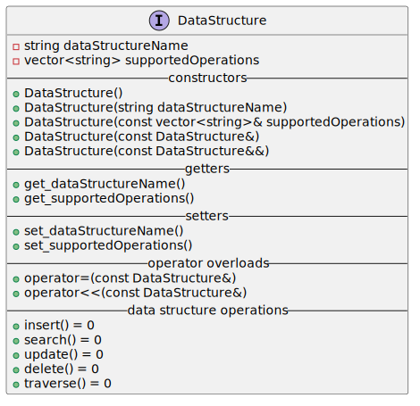

# Project Design Plan

## Language choice

**Choice:** C++

**Reason:** 

C++ has many features such as :
- smart pointers - which make coding more robust
- OOP which help in reducing code size and thus following DRY principle
- C++ is kind of superset of C language

## Plan for implement Student Persona

### Requirement
create Student objects and use some data structure to process a number of Student objects

### Case 1
- `class Student` inherits from `abstract Class Person` 
- `class Person` has member variables and member functions which is inherited by `class Student`
- `class Student` has additional Student specific data members and member functions.

_**Thought process for creating separate classes**_
- creating a single Student class with required member variables and member functions is sufficient here, but chose to create separate classes to demonstrate the concept of inheritance, abstract class, virtual functions, etc

### Case 2
- `class Student` is a single class containing all required member variables and member functions

_**Thought process for having a single class**_ 

Our mini application has only one Persona - Student. Had there been the need to create other Personas such as Professor, Doctor, Engineer, making an abstract class Person would have made sense as it would have reduced the code size significantly. Moreover, there is also no future requirement to add additional Personas, so it seems best to have a single class Student.

### Choice
**Case number :** 2

**Reason :** simplicity

---

## Plan for implementing data structure

### Requirements

- use the data structure linked list or any other out of (all types of stack and queue static and dynamic as well, singly linked list, double linked list, circular linked list, binary tree).

- perform the following operations :
    - insertion
    - modification
    - deletion
    - traversal
    - search

### Case 1
use any one data sturcture and implement required operations

### Case 2
Create an interface _DataStructureInterface_, and implement more than one data structure. Now, based on the user choice, the selected data strucrure is useed

## Choice
**Case number :** 2

**Reason :** usage of many concepts are required for implementing this, thus it would help to demonstrate the understanding and usage of pragramming features, data structures and algorithms

